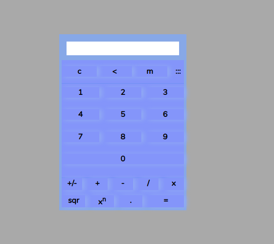

# Simple calculator app

It uses simple one function constructor with whole app incapsulate,
which possible to use at different places at the time.

## Used technics stack

*Clear java script:*

* OOP
* Private properties with obj._
* Different node selections
* Event listeners
* Keyboard events
* No `Eval` logic
___
*Screenshot:*

